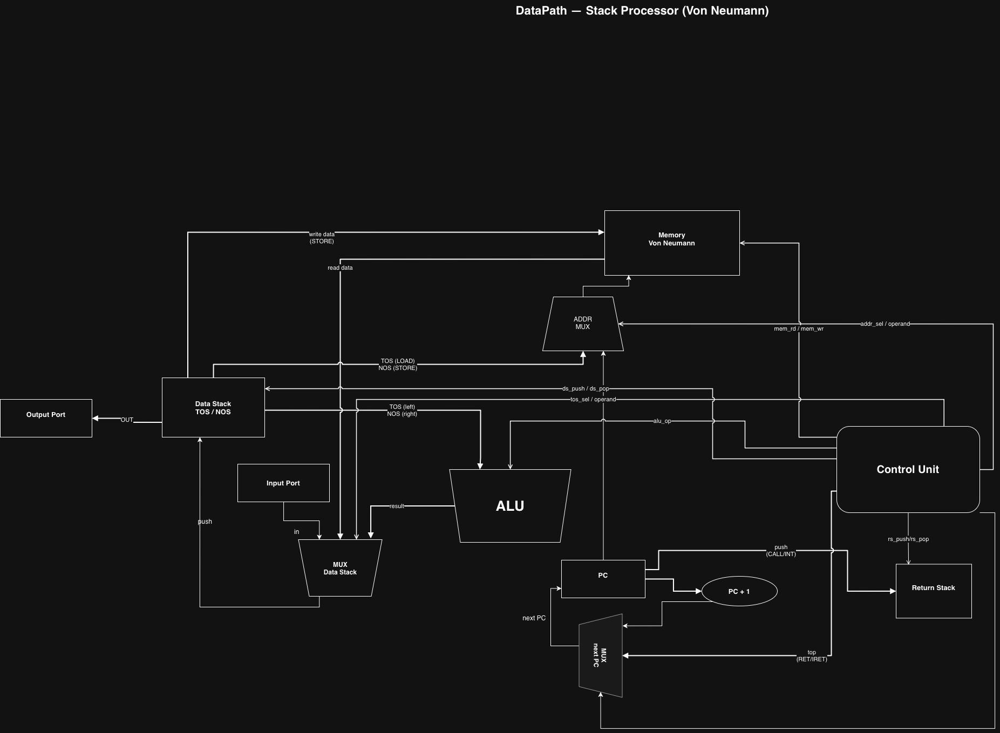
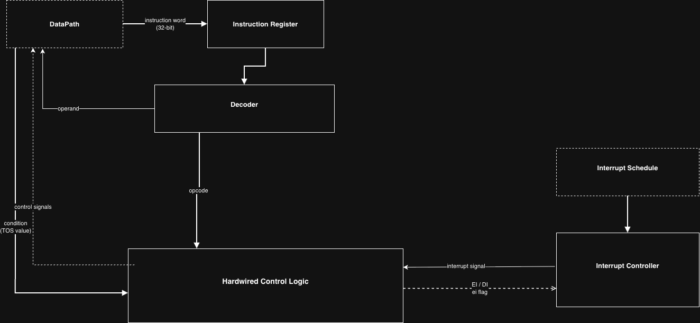

# Лабораторная работа №4. Эксперимент

**Студент**: (Родионов Максим Артемович, группа P3231)  
**Вариант**: `asm | stack | neum | hw | tick | binary | trap | port | cstr | prob2`

---

## Язык программирования

### Синтаксис

Язык — **ассемблер** для стекового процессора. Форма Бэкуса–Наура:

```bnf
program     ::= {line}
line        ::= [label] [statement] [comment] EOL
label       ::= NAME ":"
statement   ::= directive | instruction
directive   ::= ".org"  NUMBER
              | ".word" NUMBER {"," NUMBER}
              | ".str"  STRING_LITERAL
              | ".equ"  NAME  VALUE
              | ".section" NAME
              | "%define" NAME VALUE
              | "%macro" NAME | "%endmacro"
              | "%ifdef" NAME | "%ifndef" NAME | "%else" | "%endif"
instruction ::= MNEMONIC [operand]
operand     ::= NUMBER | NAME
comment     ::= ";" {any_char}
NUMBER      ::= decimal | "0x" hex
STRING_LITERAL ::= '"' {char | escape} '"'
escape      ::= "\n" | "\t" | "\r" | "\0" | "\\" | "\""
```

**Примеры**:
```asm
; Константа
%define LIMIT 4000000

; Метка и инструкция
_start:
    PUSH LIMIT          ; PUSH 4000000
    CALL my_proc

; Секция данных
.org 0x100
msg:
    .str "Hello!\n"     ; cstr — null-terminated
```

### Семантика

- **Стратегия вычислений**: строгая (eager), линейное исполнение инструкций; передача управления — только через JMP/CALL/RET/прерывания.
- **Области видимости**: все метки глобальны в рамках единицы трансляции. Локальные метки (с `.` в начале) видны только внутри функции (разделены метками без `.`). Препроцессор раскрывает `%define` текстуально.
- **Типизация**: нет типов, только 32-битные целые без знака (знак интерпретируется операцией). Строки — cstr: последовательность 32-битных слов, каждое хранит один символ (ASCII), завершается словом `0`.
- **Литералы**: числа (decimal / 0x hex) и строки в `.str`. Числа кодируются как 24-битное immediate в инструкции (знаковое расширение).
- **Макросы**: `%define NAME VALUE` — текстовая подстановка. `%macro`/`%endmacro` — группа инструкций без параметров.

---

## Организация памяти

### Модель памяти (фон Нейман)

- **Тип памяти — однопортовая**: за один такт обслуживается ровно одно обращение к памяти (один порт). Выборка инструкции (fetch) и обращения к данным (`LOAD`/`STORE`/`LOADA`/`STOREA`) выполняются на разных тактах, поэтому конфликта за единственный порт не возникает.
- **Адресация — байтовая**: каждый адрес указывает на отдельный байт. Машинное слово занимает 4 последовательных байта и хранится в формате big-endian. Поэтому адреса инструкций и слов данных кратны 4, а указатели в коде продвигаются с шагом 4.

Единая память: 262144 байта (== 65536 слов по 32 бита). Инструкции и данные — в одном адресном пространстве.

```
       Registers
+------------------------------+
| PC   — program counter       |
| IR   — instruction register  |
| (data stack, return stack)   |
+------------------------------+

       Memory (unified, single-port, byte-addressable)
       262144 bytes == 65536 x 32-bit words (big-endian)
+-------------------------------+
| 0x000  interrupt vector       |  addr of ISR handler (1 word = 4 bytes)
| 0x004  ... (reserved)         |
|                               |
| 0x010  program start          |  _start
| ...    instructions (4 B each)|
| ...    subroutines            |
| ...    ISR code               |
|                               |
| 0x100+ data constants         |  .str, .word (1 word = 4 bytes / элемент)
| ...    variables (scratch)    |  STOREA addr (адреса кратны 4)
+-------------------------------+
```

- **Однопортовая память**: единственный порт чтения/записи; одно слово за такт (`_load_word`/`_store_word` в `machine.py`).
- **Байтовая адресация**: слово = `DATA_BYTES` (4) байтовых ячеек, big-endian; `PC` инкрементируется на `INSTR_SIZE` (4) за инструкцию.
- **Инструкции**: размещаются начиная с `0x010` (`.org 0x010`), шаг 4 байта.
- **Обработчик прерываний**: адрес-слово хранится в `mem[0x000]`; сам ISR размещается по произвольному адресу в коде.
- **Статические данные**: строки `.str` (по одному слову на символ, шаг 4 байта) и константы `.word` — в секции данных (например, `.org 0x100`).
- **Динамические данные / переменные**: хранятся в фиксированных ячейках памяти (`LOADA`/`STOREA addr`), адреса кратны 4. Стека данных нет в памяти — это аппаратный стек.
- **Литералы**: числа до 24 бит кодируются как immediate (`PUSH 42`). Строки всегда в памяти.
- **Стек данных**: аппаратный, не занимает адресное пространство. Глубина 256 слов.
- **Стек возвратов**: аппаратный, отдельный. Глубина 256 слов.

---

## Система команд

### Особенности процессора

- **32-битные слова**, знаковая арифметика, беззнаковые адреса.
- **Однопортовая байтовая память**: одно слово за такт, адресация по байтам (слово = 4 байта, big-endian).
- **Стековая архитектура**: все операции работают через TOS (top of stack) и NOS (next on stack).
- **Port-mapped I/O**: `IN port` / `OUT port` — специальные инструкции.
- **Прерывания trap**: внешние прерывания доставляются по расписанию; при активации — сохраняем PC в return stack, переходим по вектору `mem[0x000]`.

### Кодирование инструкции

Каждая инструкция — 32-битное слово:

```
 31      24  23                0
+----------+--------------------+
|  opcode  |    operand (24b)   |
|  (8 bit) |  sign-extended     |
+----------+--------------------+
```

Пример: `PUSH 0x100` = `0x01000100`

### Набор инструкций

| Мнемоника     | Opcode | Такты | Описание |
|---------------|--------|-------|----------|
| `NOP`         | 0x00   | 1     | Нет операции |
| `PUSH imm`    | 0x01   | 1     | Положить 24-bit sign-ext imm |
| `POP`         | 0x02   | 1     | Снять TOS |
| `DUP`         | 0x03   | 1     | Дублировать TOS |
| `SWAP`        | 0x04   | 1     | Поменять TOS и NOS |
| `OVER`        | 0x05   | 1     | Скопировать NOS на вершину |
| `LOAD`        | 0x10   | 1     | TOS = mem[TOS] |
| `STORE`       | 0x11   | 1     | mem[NOS] = TOS; pop 2 |
| `LOADA addr`  | 0x12   | 1     | push mem[addr] |
| `STOREA addr` | 0x13   | 1     | mem[addr] = pop() |
| `ADD`         | 0x20   | 1     | TOS = NOS + TOS; pop 1 |
| `SUB`         | 0x21   | 1     | TOS = NOS - TOS; pop 1 |
| `MUL`         | 0x22   | 1     | TOS = NOS * TOS; pop 1 |
| `DIV`         | 0x23   | 1     | TOS = NOS / TOS (trunc); pop 1 |
| `MOD`         | 0x24   | 1     | TOS = NOS % TOS; pop 1 |
| `AND/OR/XOR`  | 0x25–7 | 1     | Побитовые операции |
| `NOT`         | 0x28   | 1     | TOS = ~TOS |
| `NEG`         | 0x29   | 1     | TOS = -TOS |
| `SHL/SHR`     | 0x2A–B | 1     | Сдвиги |
| `EQ/NEQ/LT/LE/GT/GE` | 0x30–35 | 1 | Сравнение; push 0/1 |
| `JMP addr`    | 0x40   | 1     | Безусловный переход |
| `JZ addr`     | 0x41   | 1     | Переход если TOS==0; pop |
| `JNZ addr`    | 0x42   | 1     | Переход если TOS!=0; pop |
| `JGZ/JLZ`    | 0x43–44| 1     | Условные переходы |
| `CALL addr`   | 0x45   | 1     | Push PC → return stack; JMP |
| `RET`         | 0x46   | 1     | PC ← pop return stack |
| `HALT`        | 0x47   | 1     | Остановка |
| `IN port`     | 0x50   | 1     | push input_port[port] |
| `OUT port`    | 0x51   | 1     | output_port[port] = pop() |
| `EI`          | 0x60   | 1     | Разрешить прерывания |
| `DI`          | 0x61   | 1     | Запретить прерывания |
| `IRET`        | 0x62   | 1     | PC ← pop return stack; EI; exit ISR |

**Классификация**: стековая архитектура. По набору команд — ближе к RISC (фиксированная длина инструкции 32 бита, простые операции), но с memory-операциями — ближе к CISC.

---

## Транслятор

### Интерфейс командной строки

```
python src/translator.py <source.asm> <output.bin> [--debug <debug.txt>]
```

- `source.asm` — исходный код на ассемблере.
- `output.bin` — бинарный файл с машинным кодом.
- `--debug debug.txt` — опциональный текстовый листинг вида `<addr> - <HEX> - <mnemonic>`.

**Пример**:
```
python src/translator.py programs/hello.asm /tmp/hello.bin --debug /tmp/hello_debug.txt
```

### Принципы работы

Двухпроходной ассемблер:

1. **Препроцессор** (перед passes):
   - Удаление комментариев (`;`).
   - Обработка `%define` / `.equ` — текстовая замена.
   - Сбор и развёртывание `%macro`/`%endmacro`.
   - Условная компиляция: `%ifdef`/`%ifndef`/`%else`/`%endif`.

2. **Проход 1** — сбор меток: обходит строки, отслеживает `.org`, `.word`, `.str`, инструкции и записывает адреса меток в таблицу. Адреса байтовые: инструкция и каждое слово `.word`/`.str` занимают `DATA_BYTES` (4) байта, поэтому счётчик адреса растёт с шагом 4.

3. **Проход 2** — генерация кода: разрешает операнды (метки → числа) и вызывает `encode_instruction(opcode, operand)` → 32-bit word. Данные `.word`/`.str` записываются как raw words, по 4 байта на элемент.

4. **Вывод**: бинарный формат — заголовок (количество пар), затем пары `(addr: uint32, word: uint32)` big-endian; `addr` — байтовый адрес (кратен 4).

---

## Модель процессора

### DataPath




### ControlUnit (Hardwired)




### Особенности реализации

- Модель тиктово-точная: каждая операция добавляет тики. Каждое обращение к памяти (`LOAD`/`STORE`/`LOADA`/`STOREA`, а также fetch) добавляет 1 тик.
- `step()` выполняет одну инструкцию: проверка прерываний → fetch → execute.
- Прерывания обрабатываются через очередь `_interrupt_queue`: символы из расписания ставятся в очередь в порядке поступления; одно прерывание за раз (пока не выполнен IRET).
- ISR в журнале помечается флагом ` ISR`.


## Тестирование

### Инструментальная цепочка

```bash
# Трансляция
python src/translator.py programs/hello.asm /tmp/hello.bin --debug /tmp/hello_debug.txt

# Симуляция (входной файл — расписание прерываний)
python src/machine.py /tmp/hello.bin input.txt

# Все тесты
pytest tests/test_golden.py -v

# Перегенерировать эталоны (после изменения программ)
pytest tests/test_golden.py --update-goldens
```

### Golden Tests 

Тесты хранятся в `tests/golden/*.yml`. Каждый файл содержит исходный код алгоритма, машинный код (дамп с адресами и мнемониками), ожидаемый вывод и полный журнал тактов.

| Алгоритм           | Входные данные | Ожидаемый вывод |
|--------------------|----------------|-----------------|
| `hello`            | — | `Hello, World!\n` |
| `cat`              | `hello\0` (расписание прерываний) | `hello` |
| `hello_user_name`  | `Alice\n` (расписание прерываний) | `What is your name?\nHello, Alice!\n` |
| `sort`             | `5 3 1 4 2\0` (расписание прерываний) | `1\n2\n3\n4\n5\n` |
| `prob2`            | — | `25164150\n` |
| `double_precision` | — | `1099511627776\n` |
| `demo_features`    | — | `751\n` (особенности варианта: `%macro`, `%ifdef`, `OVER`/`SWAP`, `SHL`, отрицательный immediate) |

### Примеры работы

#### hello

```
$ python src/translator.py programs/hello.asm /tmp/hello.bin --debug /tmp/hello_debug.txt
Assembled 32 words -> /tmp/hello.bin

$ python src/machine.py /tmp/hello.bin /dev/null
Hello, World!
```

Фрагмент журнала (адреса байтовые — `PC` растёт с шагом 4):
```
tick=     1 PC=0x0010     DI                0  stk=[]
tick=     3 PC=0x0014     PUSH            256  stk=[]
tick=     5 PC=0x0018     CALL             32  stk=[256]
tick=     7 PC=0x0020     DUP               0  stk=[256]
tick=     9 PC=0x0024     LOAD              0  stk=[256, 256]
tick=    11 PC=0x0028     DUP               0  stk=[256, 72]
tick=    13 PC=0x002c     JZ               64  stk=[256, 72, 72]
  [OUT] port=1 char='H' (0x48)
```

#### cat (trap I/O)

```
$ python src/machine.py cat.bin input.txt
hello
```

Фрагмент журнала (адреса байтовые — `PC` растёт с шагом 4):
```
tick=     1 PC=0x0010     PUSH              0  stk=[]
tick=     3 PC=0x0014     STOREA          512  stk=[0]
tick=     5 PC=0x0018     EI                0  stk=[]
  [INT] entering ISR at 0x002c, saved PC=0x001c
  [IN]  port=0 value=104('h')
tick=     9 PC=0x002c ISR IN                0  stk=[]
tick=    11 PC=0x0030 ISR DUP               0  stk=[104]
tick=    13 PC=0x0034 ISR JZ               64  stk=[104, 104]
  [OUT] port=1 char='h' (0x68)
tick=    15 PC=0x0038 ISR OUT               1  stk=[104]
```

#### prob2 (Euler #6 — Sum Square Difference)

Разность между квадратом суммы и суммой квадратов первых 100 натуральных чисел:
`(1+2+…+100)² − (1²+2²+…+100²) = 25502500 − 338350 = 25164150`.

```
$ python src/machine.py prob2.bin /dev/null
25164150
```

#### double_precision (64-бит арифметика)

```
$ python src/machine.py double_precision.bin /dev/null
1099511627776

# 2^40 = 256 * 2^32 + 0  => hi=256 (не 0 — число не помещается в 32 бита!)
```

---

## Структура проекта

```
Lab4AK/
├── src/
│   ├── isa.py          # ISA: opcodes, encoding, constants
│   ├── translator.py   # 2-pass assembler, binary I/O
│   └── machine.py      # Tick-accurate processor simulator + traps
├── programs/
│   ├── hello.asm
│   ├── cat.asm
│   ├── hello_user_name.asm
│   ├── sort.asm
│   ├── prob2.asm
│   ├── double_precision.asm
│   └── demo_features.asm
├── tests/
│   ├── conftest.py     # --update-goldens flag
│   ├── test_golden.py  # 7 golden tests (pytest)
│   └── golden/
│       ├── hello.yml
│       ├── cat.yml
│       ├── hello_user_name.yml
│       ├── sort.yml
│       ├── prob2.yml
│       ├── double_precision.yml
│       └── demo_features.yml
├── .github/workflows/
│   └── ci.yml          # CI: ruff + mypy + pytest
├── pyproject.toml      # ruff/mypy/pytest config + pyyaml dep
└── README.md
```
